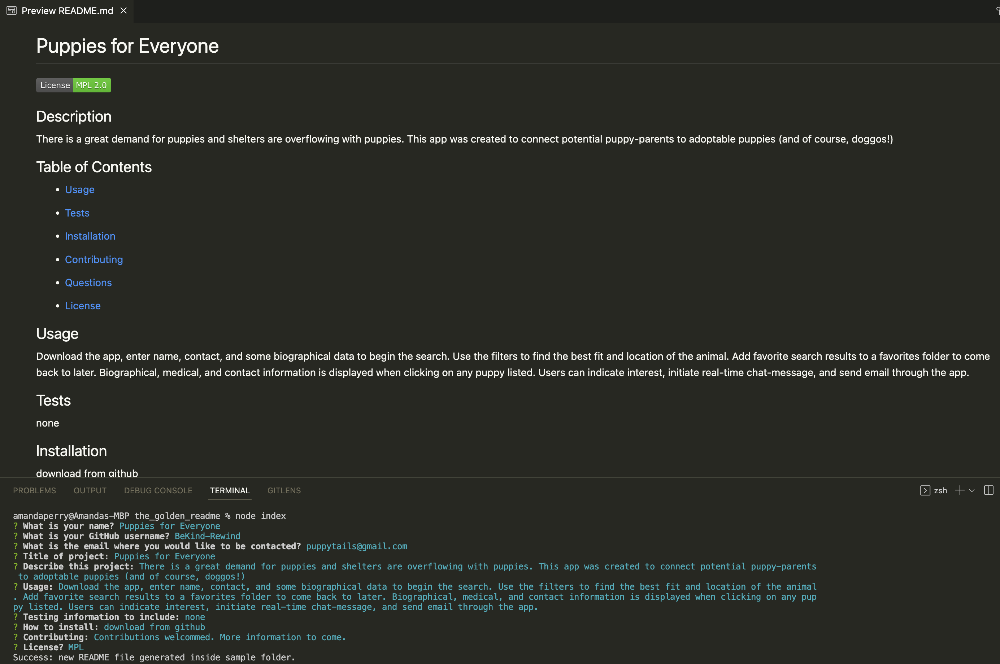

# The Golden README

## Description
The Golden README is a README.md generator to facilitate a more efficient use of time so the user can make sure to include all of the important bits in the README and focus more time on the project.

## Table of Contents
  - [Usage](#usage)
  - [Tests](#tests)
  - [Installation](#installation)
  - [Contributing](#contributing)
  - [Questions](#questions)

## Usage
The Golden README is a README.md generator that prompts the user to answer pertinent topics and populates appropriate sections of the readme.

## Screeenshot

## Video Demo URL
https://drive.google.com/file/d/1eWEFtfEjOoEDW5ao3Iu02G6GdPFPH64i/view

## Tests
none

## Installation
Requires Node.js https://nodejs.org. Then (MAC) npm install <package> (WINDOWS) C:\>npm install <package>. Finally npm init. Be sure to have the correct Inquirer dependencies: https://nodejs.com/package/inquirer.

## Contributing
If you would like to contribute, information coming soon.

## Questions

Have questions?
You can find me on GitHub:
https://github.com/BeKind-Rewind

Or email me at:
challenge641@gmail.com

    